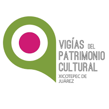
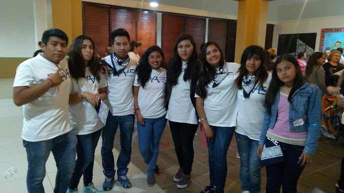

# Gloria Castañeda Barrios

## Web Developer & Graphic Designer 
---
### Técamac, Estado de mexico, México.

## Educación

- Mujer Digital JA | Desarrollo web 
& Cloud Computing

- Universidad Tecnológica de Xicotepec de juárez

- Preparatoria Oficial N° 36

## Lenguajes de Programación

- HTML5
- CSS
- JavaScript
- Java
- SQL
- Python

## Software

- Visual Studio Code
- Figma
- MySQL 
- PostgreSQL
- Photoshop
- Illustrator
- Canva
- Filmora
- Premiere
- Blender

## Idiomas

- Ingles: A2
- Español: Nativo

## Certificaciones
- 2023
    - Git y GitHub
    - Diseño web Profesional
    - Master en Colecciones y estructuras de de datos Java
    - Aprender a programar con Java
    -Fundamentos de programación

- 2018
    - CCNA | Cisco
    - IT Essentials | Cisco

## Voluntariados

*Mayo - 2019*
- Flora, Fauna y cultura de mexico A.C | Grupo Xcaret
    - *Visita de Campamento Tortuguero*
    - *Limpieza de playa*

---
- Vigias del Patrimonio cultural de Xicotepec

---
*Dic - 2017*
- FYVE Project | Filantropia y Voluntariado en Emprendimiento
    - *Enseñar y compartir la filantropia en niños*
    - *Limpieza del barrio cerca de la universidad*

### Contacto

[Email](mailto:gloria.isis1998@gmail.com)

[LinkedIn](www.linkedin.com/in/gloria-castañeda-barrios-1105351b1)

